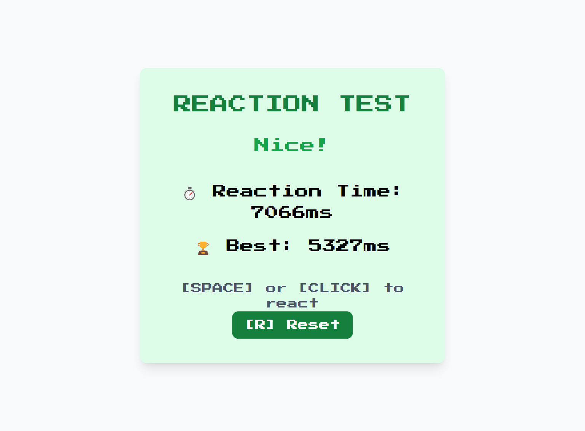

Code with emoji 😎💻

name: Reaction Time Tester

description: Measure how fast you can react to a signal.

features:
- Random delay before signal
- Timer start/stop
- Best reaction history

Demo: https://narvs1999.github.io/games_reactiontimetester/

#html #html5 #webdevelopment #webdesign #frontend #coding #programming #tailwindcss #tailwind #css #webdesign #frontenddevelopment #responsive #uiux #webdev #javascript #js #webdevelopment #frontend #coding #programming #webdev #AI #AIDevelopment #MachineLearning #ArtificialIntelligence #DeepLearning 

